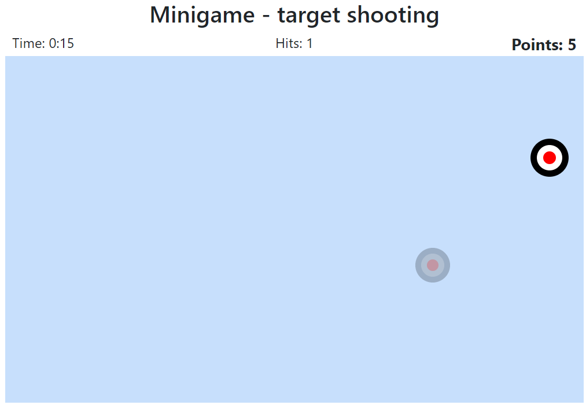
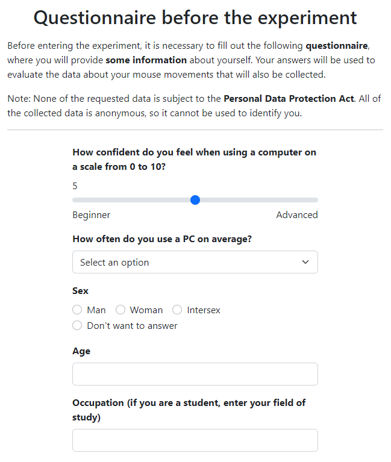
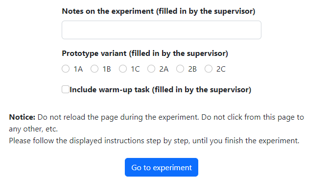

# Is Mouse Dynamics Information Credible for User Behavior Research? An Empirical Investigation

## About

This is the official repository for the research paper *"Is Mouse Dynamics Information Credible for User Behavior Research? An Empirical Investigation"*. The work investigates and addresses the relation of dependency between observed mouse dynamics and the mouse parameter configuration on the device where the observation is being conducted.

Mouse movements are a popular source of implicit data about user behavior. Mouse dynamics - the characteristics of the user's operation of a computer mouse, as well as the domain of their study - have a multitude of machine learning applications. These applications include biometric authentication, prediction of personal characteristics, emotions, intent, visual attention, etc. What often remains neglected about mouse dynamics, however, are the properties of the mouse device used to obtain them. **Mouse hardware and software can come in a great variety**, leading up to the question: **What is the relation between mouse parameter configuration and mouse dynamics?**

We conducted an study measuring the mouse dynamics of the same users using multiple different mouse configurations. We demonstrate that the majority of mouse dynamics are significantly affected by differences in mouse configuration. On the example of machine learning classification of biological sex, we show that a difference in mouse configuration can lead to inaccurate interpretation of machine learning results. Implications and suggestions for future mouse tracking studies are discussed.


### Table of contents

* [Paper citation](#paper-citation)
* [Dataset](#dataset)
* [Scripts](#scripts)
* [Experiment](#experiment)
  * [Experiment instructions](#experiment-instructions)
  * [Target shooting minigame points calculation](#target-shooting-minigame-activity-points-calculation)
  * [Questionnaire](#questionnaire)
* [Authors](#authors)
* [License](#license)


## Paper citation

Not published yet.

## Dataset

In our study, mouse tracking data is collected from respondents during a three-stage experiment. [Raw data](./analysis/data) harnessed during the experiment were exported and processed.

For each of the activities corresponding with the experiment's three stages, final [data files](./analysis/data/processed) with aggregated features were calculated:
- [Target shooting minigame activity - final data](./analysis/data/processed/minigame_aggregated_data.csv) 
- [Numbered points clicking activity - final data](./analysis/data/processed/points_aggregated_data.csv)
- [Website prototype interaction activity - final data](./analysis/data/processed/prototype_aggregated_data.csv)

## Scripts

All of the scripts are written using Python (version 3.11.3) and other external libraries installed using pip (version 22.3.1). Scripts were executed using Jupyter notebooks. A [requirements file](./analysis/requirements.txt) is provided for installing dependencies. After installing Python, the below commands can be used in the [analysis](./analysis/) directory to create the virtual environment, install dependencies and launch the Jupyter notebooks with the analysis files:
```
python -m venv .venv
.venv\Scripts\activate
pip install -r requirements.txt
jupyter notebook
```

After the above installation has been completed once, to launch the notebooks again, use the following commands:

```
.venv\Scripts\activate
jupyter notebook
```

The following script files are included in the repository:

### 1 - [Respondents](./analysis/scripts/1_respondent_statistics.ipynb)

Descriptive analysis of the respondent sample.

### 2 - [Data preparation](./analysis/scripts/2_data_preparation.ipynb)

Calculation of all aggregated features from the raw data for each of the three activities.

### 3 - Statistical analysis

These files include all statistical analysis done on the aggregated data from the three activities:
- [3.1 Mouse configuration differences](./analysis/scripts/3_1_mouse_differences.ipynb)
- [3.2 Differences between sexes](./analysis/scripts/3_2_sex_differences.ipynb)
- [3.3 Differences between target shooting minigame rounds](./analysis/scripts/3_3_game_learning.ipynb)

### 4 - Model, data and feature selection

These files include training of machine learning algorithms:
- [4.1 Model and data selection](./analysis/scripts/4_1_model_data_selection.ipynb)
- [4.2 Feature selection](./analysis/scripts/4_2_feature_selection.ipynb)

### 5 - [Final classification](./analysis/scripts/5_classification_all.ipynb)

Contains final models with hyperparameter tuning for classification of the user's biological sex.

### [Helper functions and constants](./analysis/scripts/utils.py)

Contains helper functions for statistical tests and testing of machine learning models.

## Experiment

[Experiment folder](./experiment/) contains the assets of the web application designed for conducting the experiment (html files, scripts, images,...). The experiment runs on Node.js (version 16.15.1) and requires a PostgreSQL database (version 15).

After creating the .env file in the [experiment directory](./experiment) with following contents:

```
USER=user
HOST=host
PASSWORD=password
PORT=5432
DB=db_name
```

it is possible to launch the experiment using the command line in the experiment folder:

```
npm install
node database\createDB.js
node database\createDBtables.js
node server.js
```

Server will be running at `http://localhost:8080/`. After completing the installation once, the server can be started again with only the command: `node server.js`.

### Experiment instructions

Respondents taking part in the experiment are given the following instructions before each of the experiment's three individual stages. The text is translated into English from the original Slovak version.

#### Target shooting minigame activity instructions
The goal in this minigame is to **shoot the targets** that appear in the playing area. The game has a time limit, you will see the remaining time displayed in the top left corner. \
You will receive points for each target that you hit. The **closer to the center** you hit the target, the **more points** you will receive. The targets will gradually increase in size after they are displayed. The **sooner** you hit the target, the **more points** you will receive. \
The goal is to get as many points as you can. \
The timer starts after the first target is shot.

#### Numbered points clicking activity instructions
This part consists of 6 identical small tasks.\
In each task, from the beginning, **8 points numbered from 1 to 8** are displayed over the screen. Your task is to click on these points according to their numbers, **from lowest to highest**. After clicking on the correct point, its color will change from red to green.\
The task is completed successfully when **all points are clicked in the correct order** (i.e. all points are green).

#### Prototype interaction activity instructions (variant 1 - ecommerce website)
Your **task** is to **follow the instructions** in the following online store prototype:
1. Change page **language to Slovak**
2. Add to cart
   - **Mobile Samsung Galaxy A53** (hint - categories: electronics → mobile phones → samsung)
   - **Men's red sweatshirt** (hint - categories: clothes → men's  → t-shirts and sweatshirts)
   - **White and black football** (hint - categories: sport → ball games → football)

The task will be automatically finished **after adding the product to the cart**. (Note: The wording of the task is also on the right side of the screen in the prototype.) \
**Notice:** On the prototype page, **only 1 button works** by redirecting you to the next page in accordance with the expected action. Clicking **a button other** than the expected button **will not trigger any action**. 

#### Prototype interaction activity instructions (variant 2 - coupon website)
Your **task** is to **follow the instructions** in the following discount coupon site prototype:
1. Change page **language to Slovak**
2. Purchase the:
   - **balloon ride** coupon, intended for families and belonging among the newest offers (hint - categories: experiences and fun → for families → latest)
   - **wine tasting for 2** coupon, intended for a pair and belonging among the best selling offers (hint - categories: restaurants → for pairs → best seller)
   - **party hairstyle** coupon, intended for ladies and belonging among the most popular offers (hint - categories: health and beauty → for lady → most popular)

The task will be automatically finished **after purchasing the discount coupon**. (Note: The wording of the task is also on the right side of the screen in the prototype.)\
**Notice:** In the prototype page, **only 1 button works** by redirecting you to the next page in accordance with the expected action. Clicking **on a button other** than the desired button **will not trigger any action**.

### Target shooting minigame activity points calculation

During the target shooting minigame activity (see the screenshot below), respondents receive points to their score. Higher scores are achieved by clicking zones closer to the center of the targets and by clicking the targets more quickly. The formula for calculating the number of points earned is designed to reward clicking accuracy and speed in equal measure.
 
Let $TTC$ be the time to click - the difference between the time when a target was displayed and when it was clicked. Let $BRT=500ms$ be the base reaction time - a constant time during which points are not deducted. Let $AST=2000ms$ be the animation scaling time - a time period of constant length during which the target is scaling up. Let $min(A)$ be a function that returns the lowest numerical value from set $A$, where $A \subseteq R$. Let $MTPR=0.7$ be the maximum time penalization ratio, the maximum ratio of points that may be lost due to late clicking of the target. Let $BTP$ be the base target points - the number of points earned by clicking a zone of the target, set to 10 for the inner zone, 5 for the middle zone and 1 for the outer zone. Then $PE$, the points earned are defined as:

$$
PE = BTP \cdot \left(1 - MTPR \cdot \frac{min(TTC, AST) - BRT}{AST - BRT}\right)
$$



### Questionnaire

The questionnaire presented to the respondents before each iteration of the study (each completion of the three activities with a different mouse parameter configuration). Includes questions answered by respondents and by the moderator managing the swap of mouse parameter configurations. Translated into English from the original Slovak version.

<table><tr>
<td></td>
<td></td>
</tr></table>


## Authors

### General contact 

Email: 
**micemics.research@gmail.com**


**Eduard Kuric**\
He received his PhD degree in computer science from the [Faculty of Informatics and Information Technologies](https://www.fiit.stuba.sk/), [Slovak University of Technology in Bratislava](https://www.stuba.sk/). He is a researcher and assistant professor at the same university. His research interests include human-computer interaction, user modeling, personalized web-based systems, and machine learning. Eduard is also the head of the UX Research Department and the founder of [UXtweak](https://www.uxtweak.com/).
- [LinkedIn](https://www.linkedin.com/in/eduard-kuric-b7141280/)
- [Google Scholar](https://scholar.google.com/citations?user=MwjpNoAAAAAJ&hl=en&oi=ao)
- Email: eduard.kuric([AT])stuba.sk

**Peter Demcak**\
He received his master’s degree in computer science from the [Faculty of Informatics and Information Technologies](https://www.fiit.stuba.sk/), [Slovak University of Technology in Bratislava](https://www.stuba.sk/). He is a researcher with background in software engineering, whose current topics of interest involve user behavior, human-computer interaction, UX research methods & design practices, and machine learning. Currently occupies the position of a scientific and user experience researcher at [UXtweak](https://www.uxtweak.com/), with focus on research that supports work of UX professionals.
- Email: peter.demcak([AT])uxtweak.com

**Matus Krajcovic**\
User experience researcher at [UXtweak](https://www.uxtweak.com/) and computer science student at [Faculty of Informatics and Information Technologies](https://www.fiit.stuba.sk/), [Slovak University of Technology in Bratislava](https://www.stuba.sk/). Currently focuses on data analysis and research in machine learning use in the field of human-computer interaction.
- [LinkedIn](https://linkedin.com/in/matus-krajcovic)
- Email: matus.krajcovic([AT])uxtweak.com

**Peter Nemcek**\
He holds a master’s degree in computer science from the [Faculty of Informatics and Information Technologies](https://www.fiit.stuba.sk/), [Slovak University of Technology in Bratislava](https://www.stuba.sk/). He specializes in areas such as user behavior, UX research methods and design principles, as well as machine learning. Presently holds the role of a scientific and user experience researcher at UXtweak, where he focuses on user behavior analytics.

## License
This work is licensed under a [Creative Commons Attribution-NonCommercial 4.0 International License](http://creativecommons.org/licenses/by-nc/4.0/).

[](http://creativecommons.org/licenses/by-nc/4.0/)
